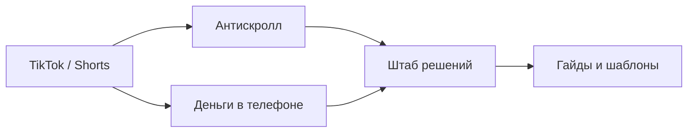

# Карта серий

## Логика воронки

## Активные серии

- [[05 Серии/7 дней без автоскролла]]
- [[05 Серии/Телефон не хозяин]]
- [[05 Серии/Фокус за 25 минут]]
- [[05 Серии/Первые 10000 без сказок]]
- [[05 Серии/Нейросети как подработка]]
- [[05 Серии/Минус лишние подписки]]

## Связи между темами

- Антискролл дает привычку фокусироваться.
- Деньги в телефоне дает способ превратить фокус в маленький доход или экономию.
- Штаб решений дает шаблоны, чтобы человек не потерялся.
