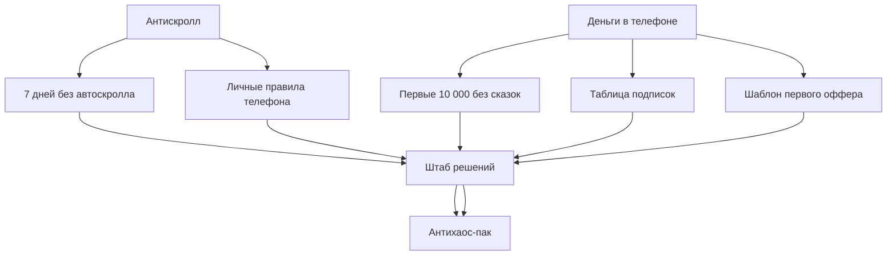

# Каталог мини-продуктов

Мини-продукт = маленький инструмент, который человек может забрать и применить сегодня. Не курс. Не огромный гайд. Конкретный результат за 10-40 минут.

## Приоритет на старт

| Приоритет | Продукт | Канал входа | Формат | Цена/роль |
|---:|---|---|---|---|
| 1 | [[#1. Первые 10 000 без сказок]] | [[01 Каналы/Деньги в телефоне]] | PDF + Google Docs | 300 руб |
| 2 | [[07 Мини-продукты/Деньги в телефоне/Шаблон первого оффера|Шаблон первого оффера]] | [[01 Каналы/Деньги в телефоне]] | Google Docs | лид-магнит / 99 руб |
| 3 | [[#3. Таблица подписок]] | [[01 Каналы/Деньги в телефоне]] | Google Sheets | бесплатно за вход в Штаб |
| 4 | [[07 Мини-продукты/Антискролл/7 дней без автоскролла|7 дней без автоскролла]] | [[01 Каналы/Антискролл]] | PDF-чеклист | бесплатно / 99 руб |
| 5 | [[#5. Личные правила телефона]] | [[01 Каналы/Антискролл]] | Google Docs | лид-магнит |
| 6 | [[07 Мини-продукты/Штаб решений/Антихаос-пак|Антихаос-пак]] | [[01 Каналы/Штаб решений]] | набор шаблонов | 499 руб |

## Деньги в телефоне

### 1. Первые 10 000 без сказок

Формат: PDF + Google Docs.
Цена: 300 руб.
Цель: первый платный продукт.

Что внутри:
- карта навыков: что я уже могу продать;
- 30 маленьких услуг для старта;
- формула оффера;
- скрипт первого сообщения;
- трекер 20 попыток;
- чек-лист "не обещай лишнего".

Посты, которые ведут сюда:
- [[02 Посты/Деньги в телефоне/2026-07-01 - Не ищи схему ищи услугу]]
- [[02 Посты/Деньги в телефоне/2026-07-01 - Скрипт первого сообщения клиенту]]

### 2. Шаблон первого оффера

Формат: Google Docs / Notion.
Цена: бесплатно за подписку в Штаб или 99 руб.
Цель: быстрый лид-магнит.
Готовая версия: [[07 Мини-продукты/Деньги в телефоне/Шаблон первого оффера]]

Что внутри:
- формула "кому + задача + результат";
- 10 примеров офферов;
- анти-примеры мутных офферов;
- чек-лист проверки за 5 секунд;
- поле для своего варианта.

Посты, которые ведут сюда:
- [[02 Посты/Штаб решений/2026-07-01 - Шаблон оффера на маленькую услугу]]

### 3. Таблица подписок

Формат: Google Sheets.
Цена: бесплатно за вход в Штаб.
Цель: дать быструю пользу и собрать активных.

Что внутри:
- таблица подписок;
- цена в месяц/год;
- колонка "пользовался 30 дней";
- решение: оставить / отменить / подумать;
- сумма потенциальной экономии.

Посты, которые ведут сюда:
- [[02 Посты/Деньги в телефоне/2026-07-01 - Подписки съедают деньги тихо]]
- [[02 Посты/Штаб решений/2026-07-01 - Таблица подписок]]

### 4. 30 микрозадач для фриланса

Формат: PDF-список.
Цена: 149 руб.
Цель: снять ступор "я ничего не умею".

Что внутри:
- 30 задач на 15-60 минут;
- где искать такие задачи;
- что показать в примере;
- как не взять слишком сложное;
- мини-трекер первых откликов.

### 5. Нейросети как подработка

Формат: PDF + промпты.
Цена: 249 руб.
Цель: монетизировать тему AI без сказок.

Что внутри:
- 15 услуг, где AI ускоряет работу;
- промпты для постов, описаний, идей, таблиц;
- как проверять качество ответа;
- как упаковать результат клиенту;
- список ошибок новичка.

### 6. Кэшбэк без мусора

Формат: чек-лист.
Цена: бесплатно / 99 руб.
Цель: партнерки и доверие.

Что внутри:
- как проверить условия кэшбэка;
- где обычно подвох;
- когда кэшбэк невыгоден;
- таблица сравнения сервисов;
- правило "не покупай лишнее ради процента".

### 7. Тарифы и подписки: минус лишние траты

Формат: Google Sheets + PDF.
Цена: 199 руб.
Цель: продукт на экономию.

Что внутри:
- ревизия мобильного тарифа;
- ревизия подписок;
- чек-лист скрытых списаний;
- напоминания перед оплатой;
- план "что отменить сегодня".

## Антискролл

### 8. 7 дней без автоскролла

Формат: PDF-челлендж.
Цена: бесплатно / 99 руб.
Цель: вовлечение и вход в Штаб.
Готовая версия: [[07 Мини-продукты/Антискролл/7 дней без автоскролла]]

Что внутри:
- 7 ежедневных заданий;
- трекер экранного времени;
- поле "что сработало";
- вечерний чек;
- финальные личные правила.

Посты, которые ведут сюда:
- [[02 Посты/Антискролл/2026-07-01 - 40 минут без автоскролла]]

### 9. Личные правила телефона

Формат: Google Docs.
Цена: лид-магнит.
Цель: быстрый полезный шаблон.

Что внутри:
- когда телефон не лежит рядом;
- какие приложения не открываю утром;
- где телефон ночью;
- чем заменяю скролл;
- как измеряю прогресс.

Посты, которые ведут сюда:
- [[02 Посты/Штаб решений/2026-07-01 - Шаблон личных правил телефона]]

### 10. Фокус за 25 минут

Формат: PDF-инструкция.
Цена: 99 руб.
Цель: простой продукт для подростков/студентов.

Что внутри:
- подготовка рабочего места;
- правило одной вкладки;
- таймер 25 минут;
- трекер результата;
- что делать, если сорвался.

### 11. Антискролл перед сном

Формат: чек-лист.
Цена: бесплатно / 99 руб.
Цель: очень понятная боль.

Что внутри:
- вечерний стоп-лист;
- куда класть телефон;
- чем заменить ленту;
- 5-минутная разгрузка головы;
- трекер сна и залипания.

### 12. Карта триггеров залипания

Формат: рабочий лист.
Цена: 149 руб.
Цель: помочь человеку понять, где он сливает внимание.

Что внутри:
- триггер;
- время;
- приложение;
- эмоция до/после;
- чем заменить;
- вывод недели.

### 13. Неделя без утренней ленты

Формат: PDF-челлендж.
Цена: бесплатно для Штаба.
Цель: серия для роста канала.

Что внутри:
- 7 утренних заданий;
- замена первого захода в телефон;
- список коротких действий;
- трекер "первый экран дня";
- итоговый разбор.

## Штаб решений

### 14. Антихаос-пак

Формат: набор Google Docs / Notion.
Цена: 499 руб.
Цель: главный пакет для приватного канала.
Готовая версия: [[07 Мини-продукты/Штаб решений/Антихаос-пак]]

Что внутри:
- шаблон разбора задачи;
- план недели;
- таблица подписок;
- шаблон оффера;
- трекер действий;
- контент-план на 7 дней.

### 15. Шаблон разбора задачи

Формат: Google Docs.
Цена: 99 руб / бонус в Штабе.
Цель: быстро дать пользу ядру.

Что внутри:
- результат на выходе;
- что уже есть;
- главный стопор;
- первый шаг;
- кому что отправить;
- контрольная точка.

### 16. Контент-план на 7 дней

Формат: Notion / Google Sheets.
Цена: 199 руб.
Цель: продукт для людей, которые тоже ведут канал/акк.

Что внутри:
- 7 дней;
- темы;
- хуки;
- визуалы;
- CTA;
- статус публикации.

### 17. Трекер первых клиентов

Формат: Google Sheets.
Цена: 149 руб.
Цель: дополнение к гайду про 10 000.

Что внутри:
- кому написал;
- что предложил;
- ответ;
- следующий шаг;
- результат;
- вывод по офферу.

### 18. План недели без хаоса

Формат: PDF + Google Docs.
Цена: 199 руб.
Цель: полезный продукт не только про деньги.

Что внутри:
- 3 главные задачи;
- 5 маленьких шагов;
- стоп-лист;
- расписание фокуса;
- вечерний чек.

### 19. Шаблон личной операционки

Формат: Notion.
Цена: 399 руб.
Цель: более дорогой шаблон.

Что внутри:
- задачи;
- деньги;
- привычки;
- контент;
- идеи;
- контроль недели.

## Быстрые бесплатные лид-магниты

### 20. 10 фраз против автоскролла

Формат: карточка/PDF.
Роль: бесплатный вход в Штаб.

### 21. 15 идей услуг с телефона

Формат: PDF.
Роль: прогрев к гайду "Первые 10 000".

### 22. Чек-лист "не ведись на схему"

Формат: карточка.
Роль: доверие в канале про деньги.

### 23. Таблица "идея -> пост -> визуал"

Формат: Google Sheets.
Роль: полезный инструмент для контентщиков.

### 24. 7 промптов для постов в Telegram

Формат: PDF.
Роль: прогрев к контент-плану.

### 25. 5 правил нормального кэшбэка

Формат: карточка.
Роль: прогрев к партнеркам.

## Что делать первым

1. Собрать [[#3. Таблица подписок]] как бесплатный лид-магнит.
2. Собрать [[#2. Шаблон первого оффера]] как бонус в Штабе.
3. Потом сделать [[#1. Первые 10 000 без сказок]] за 300 руб.
4. После этого упаковать [[#14. Антихаос-пак]] как набор за 499 руб.

## Связь с контентом

