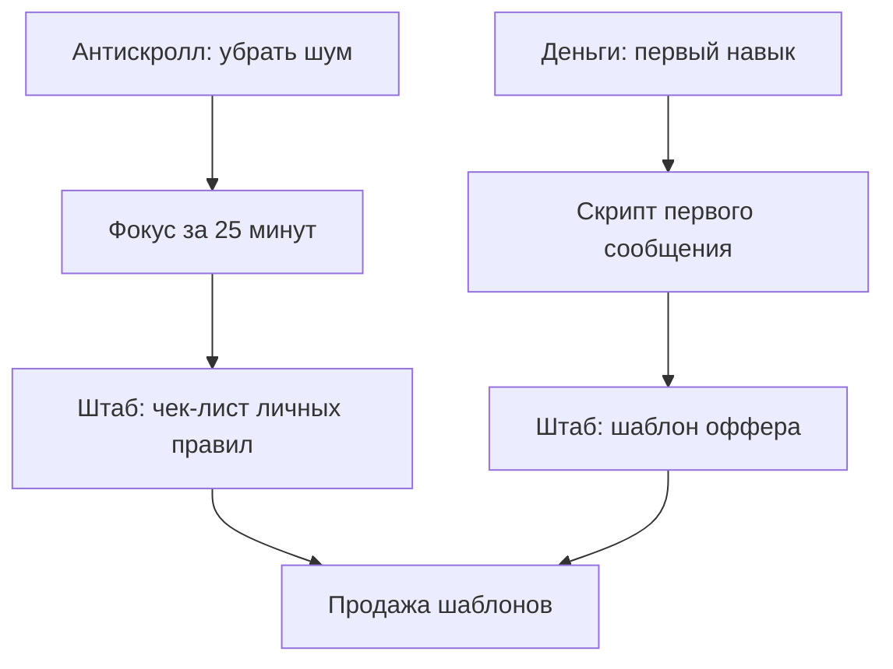

# План развития каналов

## Ближайшая цель

Собрать понятную сетку контента: два публичных канала прогревают, приватный канал продает инструменты.

## 30 дней

### Антискролл

- Запустить 3 серии: [[05 Серии/7 дней без автоскролла]], [[05 Серии/Телефон не хозяин]], [[05 Серии/Фокус за 25 минут]].
- Каждый день: 1 практический пост, 1 интерактив, 1 короткий разбор.
- Раз в 3 дня: мост в [[01 Каналы/Штаб решений]] через чек-лист.

### Деньги в телефоне

- Запустить 3 серии: [[05 Серии/Первые 10000 без сказок]], [[05 Серии/Нейросети как подработка]], [[05 Серии/Минус лишние подписки]].
- Каждый день: 1 идея заработка/экономии, 1 разбор, 1 интерактив.
- Раз в 3 дня: мягкая подводка к гайду или шаблону.

### Штаб решений

- 2-3 сильных материала в неделю.
- Каждый материал должен быть инструментом: шаблон, чек-лист, разбор.

## Контент-связи

