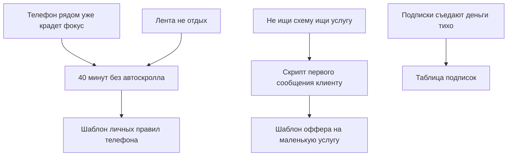

# Расписание постов - стартовая неделя

Период: 1-3 июля 2026

## Логика

Каждый день даем связку:

- [[01 Каналы/Антискролл|Антискролл]] цепляет внимание и прогревает через проблему фокуса.
- [[01 Каналы/Деньги в телефоне|Деньги в телефоне]] переводит внимание в деньги/экономию.
- [[01 Каналы/Штаб решений|Штаб решений]] дает инструмент, который продолжает публичный пост.

## Расписание

| Дата | Время | Канал | Пост | Роль |
|---|---:|---|---|---|
| 2026-07-01 | 10:00 | Антискролл | [[2026-07-01 - Телефон рядом уже крадет фокус]] | полезный пост |
| 2026-07-01 | 14:00 | Деньги в телефоне | [[2026-07-01 - Не ищи схему ищи услугу]] | глубокий разбор |
| 2026-07-01 | 18:00 | Антискролл | [[2026-07-01 - 40 минут без автоскролла]] | интерактив |
| 2026-07-01 | 21:00 | Штаб решений | [[2026-07-01 - Шаблон личных правил телефона]] | бонус/шаблон |
| 2026-07-02 | 10:00 | Деньги в телефоне | [[2026-07-01 - Скрипт первого сообщения клиенту]] | полезный пост |
| 2026-07-02 | 14:00 | Антискролл | [[2026-07-01 - Лента не отдых]] | разбор |
| 2026-07-02 | 18:00 | Деньги в телефоне | [[2026-07-01 - Подписки съедают деньги тихо]] | интерактив |
| 2026-07-02 | 21:00 | Штаб решений | [[2026-07-01 - Шаблон оффера на маленькую услугу]] | шаблон |
| 2026-07-03 | 21:00 | Штаб решений | [[2026-07-01 - Таблица подписок]] | шаблон |

## Связи

## Что делать после публикации

1. В каждом публичном посте смотреть ответы на вопрос в конце.
2. Самые частые ответы превращать в следующий пост.
3. В Штабе давать шаблон под самую частую боль.
4. Через 3-4 дня собрать мини-серию в один закреп.
