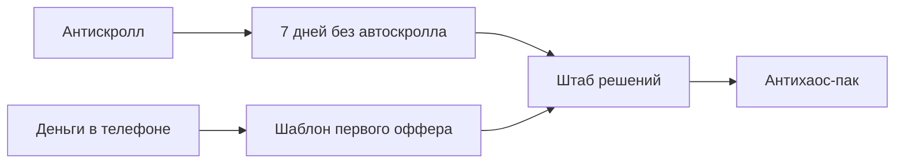

# Индекс мини-продуктов

## Готово

| Канал | Продукт | Роль | Цена |
|---|---|---|---:|
| [[01 Каналы/Антискролл]] | [[07 Мини-продукты/Антискролл/7 дней без автоскролла]] | лид-магнит / челлендж | 0-99 |
| [[01 Каналы/Деньги в телефоне]] | [[07 Мини-продукты/Деньги в телефоне/Шаблон первого оффера]] | лид-магнит / вход в заработок | 0-99 |
| [[01 Каналы/Штаб решений]] | [[07 Мини-продукты/Штаб решений/Антихаос-пак]] | первый платный набор | 499 |

## Как использовать

1. Публичный канал дает боль и обещание.
2. Человек пишет кодовое слово.
3. В [[01 Каналы/Штаб решений|Штабе]] получает мини-продукт.
4. После применения получает апселл на следующий продукт.

## Воронка

